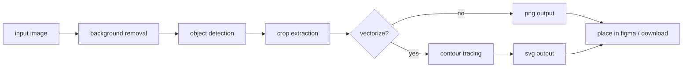
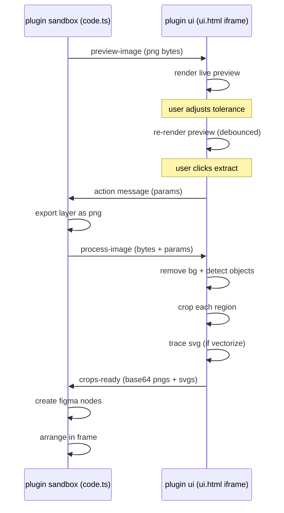
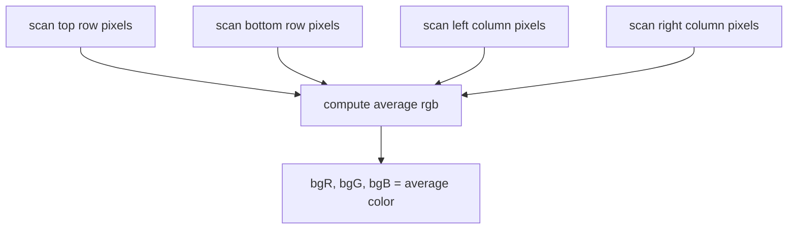
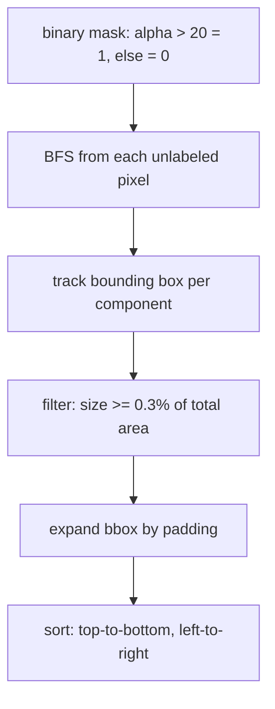
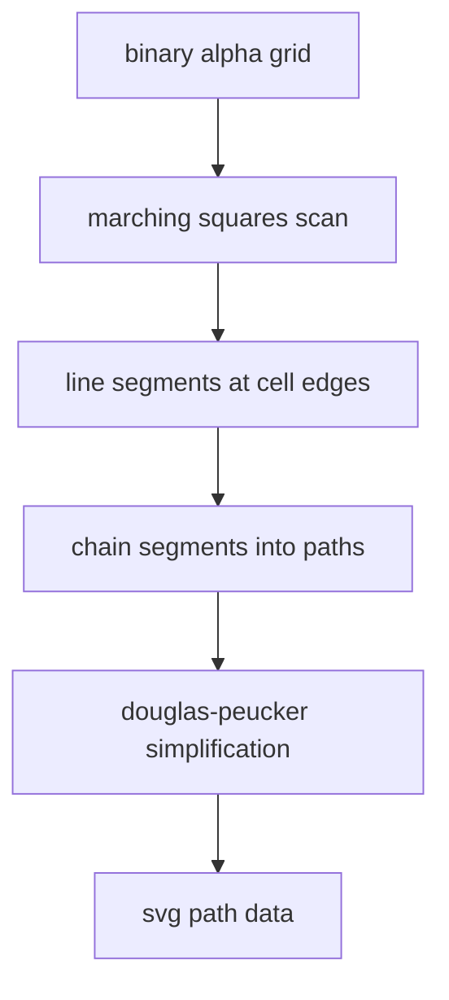
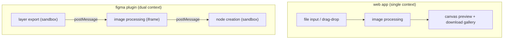

# under the hood

technical deep-dive into how pack splitter works.

## architecture overview



## figma plugin architecture

the plugin runs in two separate contexts that communicate via message passing:



### why processing happens in the ui iframe

the figma plugin sandbox does not have access to canvas/imagedata apis. all pixel-level image processing (flood fill, connected components, contour tracing) must happen in the ui iframe which has full browser apis including `OffscreenCanvas`.

## background removal algorithm

### step 1: sample border pixels



pixels with alpha < 20 are skipped (already transparent). the average rgb of all opaque border pixels becomes the reference background color.

### step 2: flood fill from edges

```
for each border pixel:
    if colorDistance(pixel, bgColor) <= tolerance * 2.21:
        mark as background
        add to BFS queue

while queue not empty:
    pixel = dequeue
    for each 4-connected neighbor:
        if not yet visited AND colorDistance(neighbor, bgColor) <= threshold:
            mark as background
            enqueue neighbor
```

the color distance is euclidean in rgb space:
```
distance = sqrt((r1-r2)² + (g1-g2)² + (b1-b2)²)
```

### step 3: interior removal (optional)

when enabled, a second pass marks ANY pixel matching the background color — regardless of whether it's connected to the edge flood fill:

```
for each pixel in image:
    if not already marked AND colorDistance(pixel, bgColor) <= threshold:
        mark as background
```

this catches interior white areas (gaps between stickers, holes in shapes) that the edge flood fill can't reach.

### step 4: apply transparency

```
for each pixel marked as background:
    set alpha = 0
```

## connected-component labeling



the algorithm:
1. create a binary mask from the alpha channel (opaque = 1)
2. iterate through all pixels; for each unvisited opaque pixel, start a new BFS
3. during BFS, track min/max x and y to build the bounding box
4. count pixels per component for the size filter
5. discard tiny components (< 0.3% area) as noise
6. expand each bounding box by the user's padding value
7. sort regions for consistent output order

### performance considerations

- uses `Int32Array` for the BFS queue (avoids array resizing)
- single-pass labeling (no union-find needed since we BFS immediately)
- for detection preview: downsampled to 256px max → instant feedback
- for final extraction: runs at up to 1024px for accuracy, then crops from full resolution

## vectorization: marching squares



### marching squares lookup

each 2×2 cell of the binary grid produces a 4-bit index (TL, TR, BR, BL corners). this index maps to 0, 1, or 2 line segments:

```
index = (topLeft << 3) | (topRight << 2) | (bottomRight << 1) | bottomLeft
```

16 possible cases, with line segments placed at edge midpoints. saddle cases (5 and 10) produce two segments each.

### segment chaining

segments are chained into closed paths by matching endpoints:
- start with any unused segment
- extend the path by finding another segment whose start/end is within epsilon (0.01) of the current path's end
- repeat until no more segments can be appended
- paths with < 3 points are discarded

### douglas-peucker simplification

reduces path complexity while maintaining shape fidelity:
1. find the point farthest from the line connecting first and last points
2. if distance > tolerance (1px): recursively simplify each half
3. if distance <= tolerance: replace with straight line

this typically reduces path points by 60-80% without visible quality loss.

### svg generation

the final paths are encoded as SVG path data:
```svg
<svg viewBox="0 0 W H">
  <path d="M x0,y0 L x1,y1 L x2,y2 Z M ..." fill="black"/>
</svg>
```

in figma, this svg string is passed to `figma.createNodeFromSvg()` which creates an editable vector node.

## data flow: web app vs figma plugin



the core algorithms (removeBackground, findObjects, traceAlphaToSvg) are identical between the web app and the figma plugin ui. the web app simply runs everything in one context without message passing.

## performance profile

| operation | 512px image | 1024px image | 2048px image |
|-----------|-------------|--------------|--------------|
| bg removal | ~15ms | ~50ms | ~180ms |
| object detection | ~10ms | ~35ms | ~120ms |
| vectorization (per asset) | ~5ms | ~15ms | ~50ms |
| total (5 assets, no vector) | ~30ms | ~90ms | ~320ms |

preview uses 256px downsampled images for sub-frame latency on slider input events.

## memory management

- `Int32Array` for BFS queues (pre-allocated to worst case: total pixel count)
- `Uint8Array` for binary masks and visited arrays
- `OffscreenCanvas` for image manipulation (doesn't touch DOM)
- blob urls are revoked after image load to prevent memory leaks
- the web app revokes asset urls on clear
